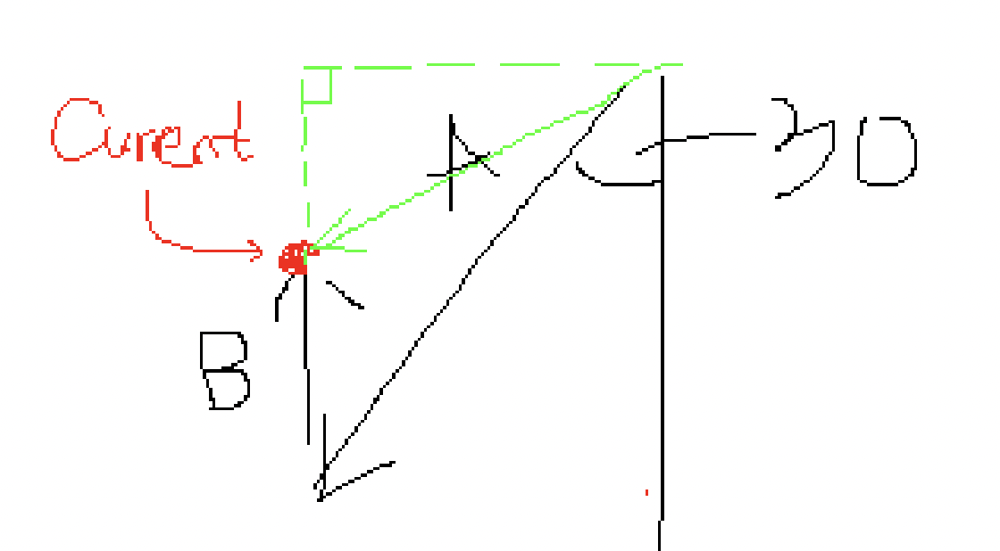
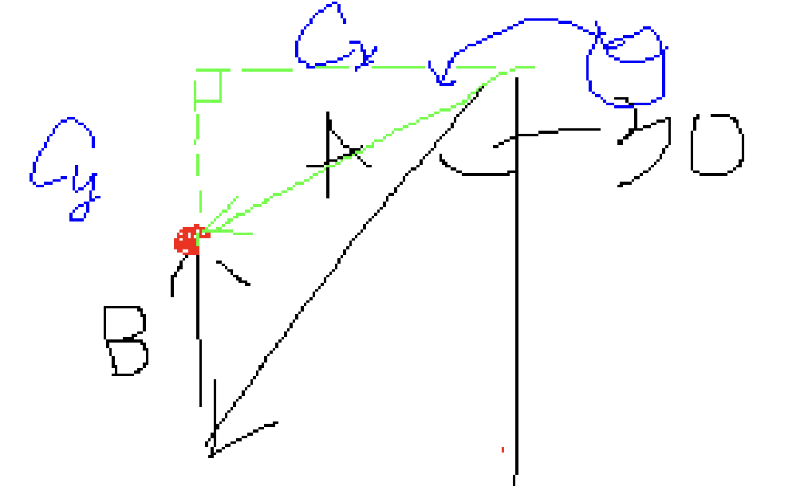

# OV_04_26_22

## Practice FRQ Problems

### Problem 1

When it asks for the magnitude and direction of the bus, imagine drawing a new vector from the origin to the current location of the bus. The **magnitude** of a vector is the length of the vector.

We need a right triangle in order to use the pythagorean theorem. Look! In green, we *created* our own right triangle. If we find its leg lengths, we can find the hypotenuse. We will call them $C_y$ and $C_x$. From the figure, its clear that the leg lengths satisfies...

$$
C_y=A_y-B_y=2090.15\\
C_x=A_x-B_x=406.75
$$

Then use pythagorean theorem to find the magnitude of vector C. Lastly, use trig relationships to find the direction of vector C.

$$
tan(\theta)=\frac{C_y}{C_x}\\
$$

To isolate $\theta$, we need to take the inverse of tan on both sides which gives us

$$
\theta = tan^{-1}(\frac{C_y}{C_x})
$$

Since the angle begins on the west vector and opens downward, the direction of vector C is $\theta$ *south of west*.